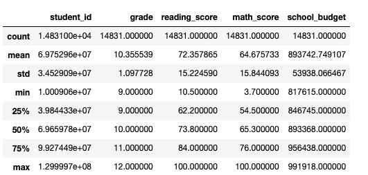
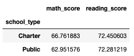
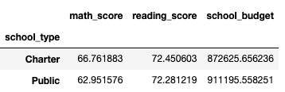

# School_District_Analysis

Tyrone Fraley,
UC Berkley Extension,
August 31, 2022

## Student Data

  

  The "Student Data Challenger Starter Code" data was analyzed with the use of Pandas and exercised in a Jupyter notebook. Upon analysis of the "Student Data Challenger Starter Code" the average math and reading scores were similar for both types of schools. The Public and Charter schools had an average reading score of 72%. Albeit, close in results the average math scores did slightly differ. Mathematical scores fo Public schools came in at 62% and Charter schools came in at 66%. When considering budget and it's causual relationship with grade averages it does denote some concern, considering the average budget for the charter schools is $38,570 on average. This could beg one to consider class room sizes, teacher salaries, teaching methods, types classrom materials, etc as possible variables that could be causing Charter schools to slightly out perform Public schools (on average) when observing the differences in budgets. 
    

  

    
   Overall, this was an important challenge to work through. Initially, the importing of data was not only important, but verifying that it was properly imported was equally crucial. This was handled through the .head() function which allowed me to analyze the data set in a data frame format with the necessary columns and first five rows of the data set. From this point, it was necessary to verify and remove missing values (.insa().sum() & .dropna()). Such functions allows one to quickly clean up the data to produce more reliable results. According to Data Independent (N.D.), "It is super helpful when you want to make sure you data has a unique key or unique rows." In addition to this procedure, I checked and removed duplicate rows (.duplicated().sum() & .drop_duplicates(inplace=True)) and verified data types with .dtypes to identify integers, floating numbers, and objects. Such clean up in data also may require removing certain entries within the data to allow the analyst to disiminate data even further. At this point in my research it was important to remove non-numeric characters from the school grades, because initially the school grade column contained objects due to the "th" following the numerical value of the grade. The letters were then removed later by using .str.replace('th', '') allowing only a numerical value being present in the student grade column, thus changing student grade from object to int64. 
    

  

    
   Midway through the analysis it was vital to then summarize the data through the .describe(), .mean(), and .min() functions. According to Melissa Rodrigues (2020), "describe(): generates descriptive statistics that will provide visibility of the dispersion and shape of a dataset’s distribution." For reporting reasons, the emprical data underwent analysis by finding the average mathematical score  and the minimum reading score for the entire data set. These methods sparked interest in the data set that could embark on further questioning of the data set in a way that contributes to the research overall. For instance, based on the provided findings I have produced another individual may be able to mirror the practices to analyze this data set. They could do this by collecting real world school data and analyze mathematical and reading scores versus school fundings on only a school level or a grade and school level. However, for ethical reasons it is important to note that this research more than likely already exists and may not be able to be published unless one finds a phenomena within the data that has not been explored yet. If that is the case I encourage the individual(s) to take this further if the uncharted phenomena is found. If not for scholarly research, this is still a usefull data set for any one practicing Data Analytics, especially when they want to exercise inferring upon causual relationships. In addition, they could take it further and compare Public versus Charter schools under the same perameters as well. To do so, it is useful to use .iloc[] and .loc[] as I have throughout the script, because it allows an individual to structure the data frame in a way that is succinct and customizable. However, it is important to keep in mind ethics at this point and ensure that the data frames are not altered in such a way to fit a bias. According to Shoonenboom and Burke Johnson (2017), "to design a mixed study, researchers must understand and carefully consider each of the dimensions of mixed methods design, and always keep an eye on the issue of validity." Finally, going back to the initial thought of parcing through data using .loc[] and .iloc[]. I used .groupby() and .sort_values() to dissiminate the data even further because I wanted to drill down to finding mean scores for Charter and Public schools, the total count (.count()) of students at the schools,  and the average budget of the Charter and Public schools. When using .groupby() the analyst, can aggregate data with functions such as: sum, max, min, and many other functions as well, (Rodriguez, 2020). 

  

## Summary

   In closing, the findings in this data set drew up causual relationships between Charter and Public schools' budgets and grades. This was found through proper data collection, summarizing, and data analytics parsing techniques through Pandas fuctions. As mentioned, such data could be contributed to the community through further research to infer upon educational performance between the two types of schools. This would possibly be best demonstrated in a mixed methods study, but could be done through quantitative analysis alone if one does not want to capture thoughts and feelings of the participants and only numerical values of the subjects. According to Schonenboom and Burke Johnson (2017) "mixed methods research (“Mixed Methods” or “MM”) is the sibling of multimethod research (“Methodenkombination”) in which either solely multiple qualitative approaches or solely multiple quantitative approaches are combined." However, in order to do this one may have to compile more research based on teaching styles and methods of the schools and the school types overall by usings the .join() function within Python. 
   
   

References:

Data Independent. (N.D.). Pandas Drop Duplicates - pd.df.drop_duplicates(). https://dataindependent.com/pandas/pandas-drop-duplicates-pd-df-drop_duplicates/

Rodriguez, M. (2020, July 28). How to Summarize Data with Pandas. Medium.com. Analytics Vidhya.https://medium.com/analytics-vidhya/how-to-summarize-data-with-pandas-2c9edffafbaf#dee7

Schoonenboom, J. & Burke Johnson, R. (2017, July 5). NCBI. How to Construct a Mixed methods Research Design.https://www.ncbi.nlm.nih.gov/pmc/articles/PMC5602001/. 107-131 doi: 10.1007/s11577-017-0454-1
